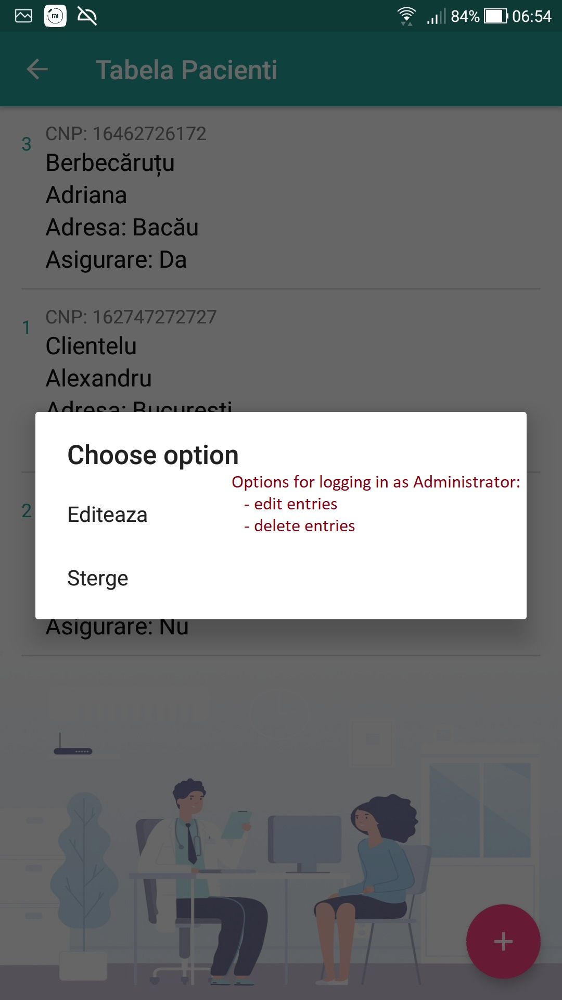
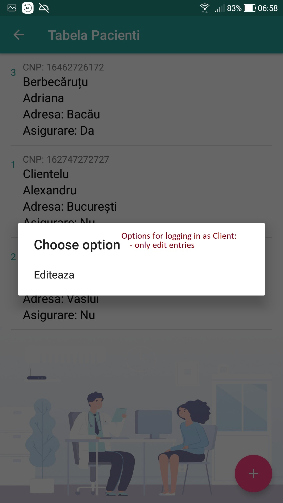
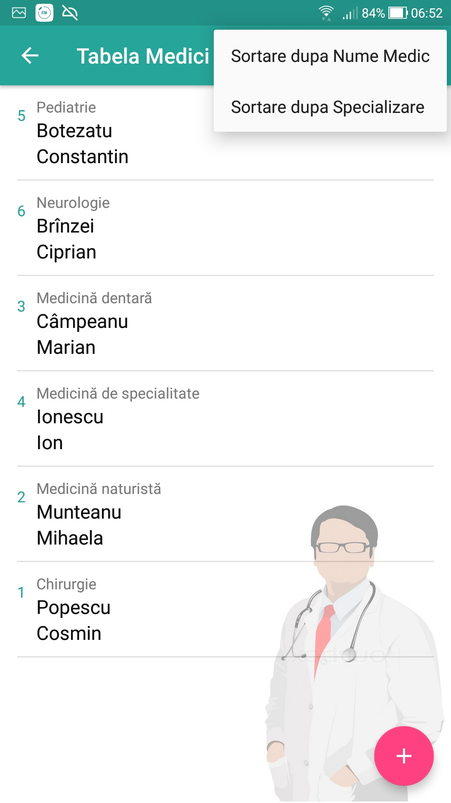
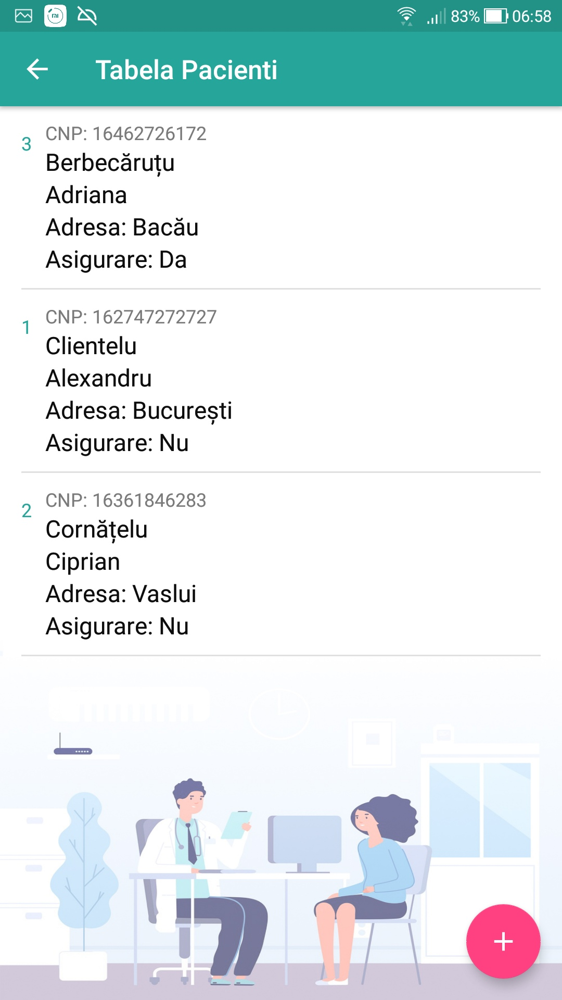
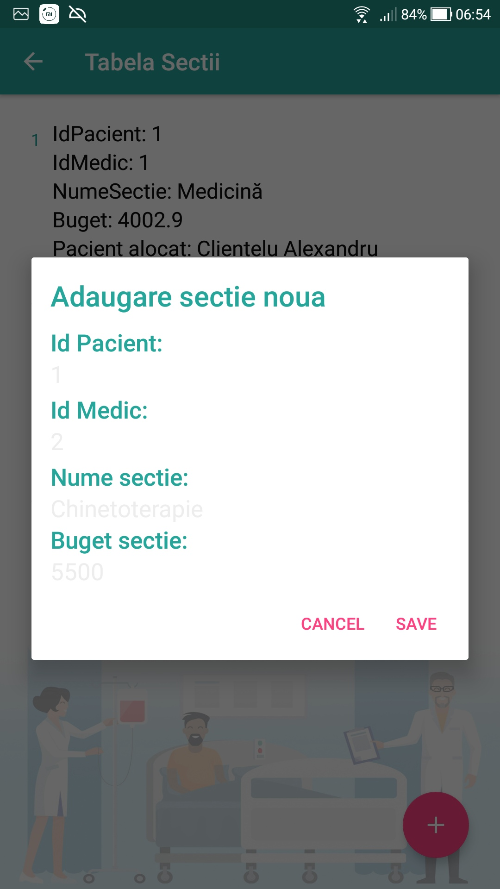
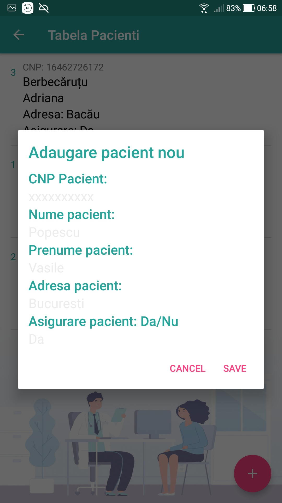
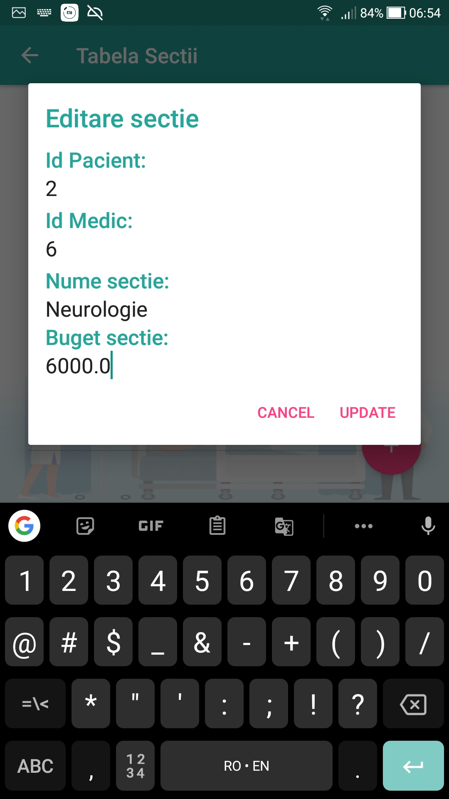
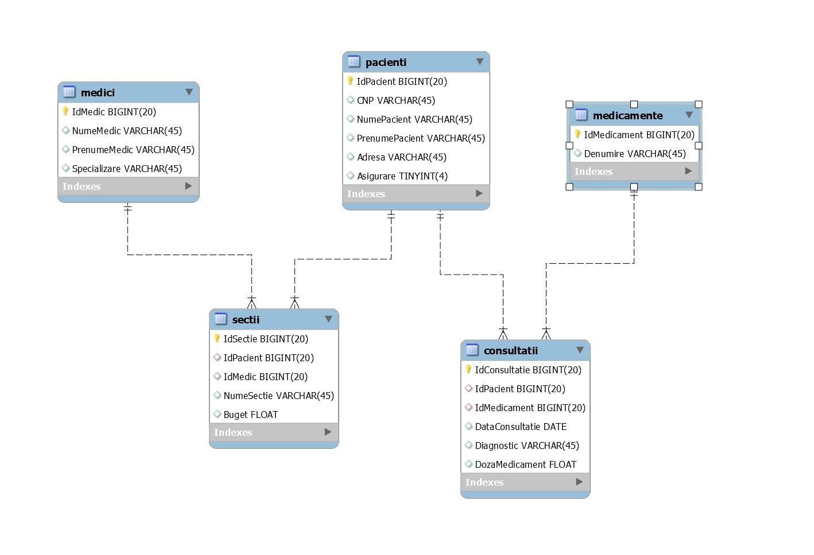

# Android-SQLite-Database-MultipleTables with Autenthication
Database management application created with SQLite, with authentication (for both Admin and User) using Android interface.


## Screenshots:
<p float="left">
  
  
  
  
</p>
<p float="left">
  
  
  
  
</p>
<p float="left">
  
  
  
  
</p>

## Database used:
The figure below shows the tables corresponding to the database diagram for the application.

The database is composed of the following tables:
- Doctor (MedicID, Medical Name, Medical First Name, Specialization);
- Patient (PatientID, CNP, Patient Name, Patient First Name, Address, Insurance);
- Medicines (MedicineID, Name).

The associations between the tables are as follows:
- between the Doctor table and the Patient table there is an association of multiplicity M:N, which will be
decomposed by a link table called Sections (with PatientID and MedicID as foreign keys).
- between the Patient table and the Medication table there is an association of multiplicity M:N. In the
in this case, the connection table will be called Consultations (with PatientID and MedicineID as foreign keys).

This diagram was made in MySQL Workbench environment, by writing the following SQL code:
```SQL
-- -----------------------------------------------------
-- Schema SQLiteProject
-- -----------------------------------------------------
CREATE SCHEMA IF NOT EXISTS `SQLiteProject`;
USE `SQLiteProject`;

-- -----------------------------------------------------
-- Table `SQLiteProject`.`pacienti`
-- -----------------------------------------------------
CREATE TABLE IF NOT EXISTS `SQLiteProject`.`pacienti` (
  `IdPacient` BIGINT(20) UNSIGNED NOT NULL AUTO_INCREMENT,
  `CNP` VARCHAR(45) NULL DEFAULT NULL,
  `NumePacient` VARCHAR(45) NULL DEFAULT NULL,
  `PrenumePacient` VARCHAR(45) NULL DEFAULT NULL,
  `Adresa` VARCHAR(45) NULL DEFAULT NULL,
  `Asigurare` TINYINT(4) NULL DEFAULT NULL,
  PRIMARY KEY (`IdPacient`))


-- -----------------------------------------------------
-- Table `SQLiteProject`.`medicamente`
-- -----------------------------------------------------
CREATE TABLE IF NOT EXISTS `SQLiteProject`.`medicamente` (
  `IdMedicament` BIGINT(20) UNSIGNED NOT NULL AUTO_INCREMENT,
  `Denumire` VARCHAR(45) NULL DEFAULT NULL,
  PRIMARY KEY (`IdMedicament`))


-- -----------------------------------------------------
-- Table `SQLiteProject`.`consultatii`
-- -----------------------------------------------------
CREATE TABLE IF NOT EXISTS `SQLiteProject`.`consultatii` (
  `IdConsultatie` BIGINT(20) UNSIGNED NOT NULL AUTO_INCREMENT,
  `IdPacient` BIGINT(20) UNSIGNED NULL DEFAULT NULL,
  `IdMedicament` BIGINT(20) UNSIGNED NULL DEFAULT NULL,
  `DataConsultatie` DATE NULL DEFAULT NULL,
  `Diagnostic` VARCHAR(45) NULL DEFAULT NULL,
  `DozaMedicament` FLOAT UNSIGNED NULL DEFAULT NULL,
  PRIMARY KEY (`IdConsultatie`),
  INDEX `fk_consultatii_1_idx` (`IdPacient` ASC) VISIBLE,
  INDEX `fk_consultatii_2_idx` (`IdMedicament` ASC) VISIBLE,
  CONSTRAINT `fk_consultatii_1`
    FOREIGN KEY (`IdPacient`)
    REFERENCES `SQLiteProject`.`pacienti` (`IdPacient`)
    ON DELETE CASCADE
    ON UPDATE CASCADE,
  CONSTRAINT `fk_consultatii_2`
    FOREIGN KEY (`IdMedicament`)
    REFERENCES `SQLiteProject`.`medicamente` (`IdMedicament`)
    ON DELETE CASCADE
    ON UPDATE CASCADE)


-- -----------------------------------------------------
-- Table `SQLiteProject`.`medici`
-- -----------------------------------------------------
CREATE TABLE IF NOT EXISTS `SQLiteProject`.`medici` (
  `IdMedic` BIGINT(20) UNSIGNED NOT NULL AUTO_INCREMENT,
  `NumeMedic` VARCHAR(45) NULL DEFAULT NULL,
  `PrenumeMedic` VARCHAR(45) NULL DEFAULT NULL,
  `Specializare` VARCHAR(45) NULL DEFAULT NULL,
  PRIMARY KEY (`IdMedic`))


-- -----------------------------------------------------
-- Table `SQLiteProject`.`sectii`
-- -----------------------------------------------------
CREATE TABLE IF NOT EXISTS `SQLiteProject`.`sectii` (
  `IdSectie` BIGINT(20) UNSIGNED NOT NULL AUTO_INCREMENT,
  `IdPacient` BIGINT(20) UNSIGNED NULL DEFAULT NULL,
  `IdMedic` BIGINT(20) UNSIGNED NULL DEFAULT NULL,
  PRIMARY KEY (`IdSectie`),
  INDEX `fk_sectii_1_idx` (`IdPacient` ASC) VISIBLE,
  INDEX `fk_sectii_2_idx` (`IdMedic` ASC) VISIBLE,
  CONSTRAINT `fk_sectii_1`
    FOREIGN KEY (`IdPacient`)
    REFERENCES `SQLiteProject`.`pacienti` (`IdPacient`)
    ON DELETE CASCADE
    ON UPDATE CASCADE,
  CONSTRAINT `fk_sectii_2`
    FOREIGN KEY (`IdMedic`)
    REFERENCES `SQLiteProject`.`medici` (`IdMedic`)
    ON DELETE CASCADE
    ON UPDATE CASCADE)
```

The interface and functionality of the application made in Android Studio will allow the user to perform operations: view, add, edit, delete. Viewing the connection tables will mean viewing the data referenced in the other tables.

## Application description:
This app will allow the user to do the following operations:
- To register as a Client user, by creating an account in the database (eg: an entry in the Users table, separated from the rest of the schema).
- To access the application by logging in either as a Client user or as an Administrator user. Customers can perform the following operations: viewing, adding and modifying data. The administrator can perform the operations of viewing, adding, modifying and deleting data. (To create a new Administrator user, it is needed to open Android Studio and call **db.InsertUtilizator("InsertName", "InsertPass", "Admin");** method in one of the **onCreate** methods (either from Activity_Login.java or Activity_Register.java)
- View data in each table.
- Insert data into each of the tables.
- Edit the data (hold down a record in a table to acces the edit/delete menu)
- Sort the doctors table by name of doctor or by specialization.
- Change the current authenticated user.

## Additional Info:
### Tables creation:
In order to use the Android interface to perform CRUD operations, it is necessary to treat the entities (records of each relation/table) as objects. Thus, for each table a class will be created, which will have its respective attributes.
- /app/src/Main/Java/../Model_Classes/Utilizatori.java
- /app/src/Main/Java/../Model_Classes/Medici.java
- /app/src/Main/Java/../Model_Classes/Sectii.java
- /app/src/Main/Java/../Model_Classes/Pacienti.java
- /app/src/Main/Java/../Model_Classes/Consultatii.java
- /app/src/Main/Java/../Model_Classes/Medicamente.java

Once created the classes for each table (Users, Doctors, Sections, Patients, Consultations, Medications), a new class named **DataBaseHelper** will be created in order to execute SQL commands. This will contain all the commands for creating the new tables and all the methods for inserting, reading, updating and deleting data (entries) from tables. In addition, this class (DataBaseHelper) will also contains some special methods (such as retrieving all the ids of a table's records and storing them in an Integer type list) that will later help perform other operations (for example, view linking tables and view data referred to from the other tables).

### Viewing the records (entries/rows) from a table
To view the records from any table, we will use a special Android class, called RecyclerView, in which the entries/rows from tables will be designed using *list_row_name_table.xml* files (so that different TextView boxes will be placed which will be later updated with the information/data to show on screen from the entries). The RecyclerView object will retrieve a list of objects of the class associated with a table; obtaining the list of objects is done by the methods getAllMedics, getAllPatients, getAllConsultations, getAllSections, getAllMedicines in the DataBaseHelper class. 

### Adding, modifying, deleting entries in a table
An authenticated user in the application (Client or Administrator) will be able to perform table insertion operations. The actual insertion into the database is done using the insertSection method (or any other insertTableName method) in the DataBaseHelper.java class. But before calling this function, in the activity of the respective table there will be a FAB (Floating Action Button) button, which when pressed will display a text box dialog to complete the data to be added. The data will then be retrieved, entered into the database by the insertSection method, which will then be called the getSection method to retrieve the new object with the added data. With this object we will update the list of objects required to display all entries using RecyclerView.

Modifying / updating involves the same steps as inserting, only taking into account the position of the selected item in RecyclerView. This item will in fact be the object in the Sections List (the list of objects in the classes), in which the respective id will be searched to call the updateSections method in the DataBaseHelper, followed by updating the data.

## Find me on Social Networks:
***My portfolio:*** [radubulai.com](https://radualexandrub.github.io/)<br>
***My blog:*** [CodingTranquillity](https://codingtranquillity.herokuapp.com/)

<a href="https://github.com/radualexandrub" target="_blank"></a>&nbsp;&nbsp;
<a href="https://www.linkedin.com/in/radu-alexandru-bulai/" target="_blank"></a>&nbsp;&nbsp;
<a href="https://dev.to/radualexandrub" target="_blank"></a>&nbsp;&nbsp;
<a href="https://www.hackerrank.com/RaduAlexandruB" target="_blank"></a>&nbsp;&nbsp;
<a href="https://www.flickr.com/photos/radualexandru" target="_blank"></a>&nbsp;&nbsp;
<a href="https://www.mixcloud.com/radu-alexandru7" target="_blank"></a>&nbsp;&nbsp;
